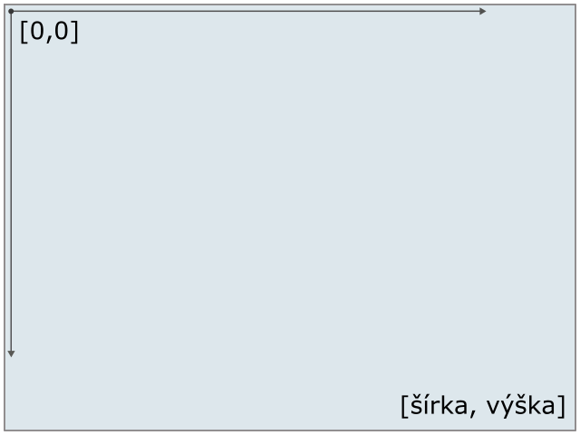
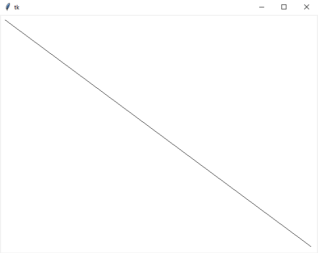
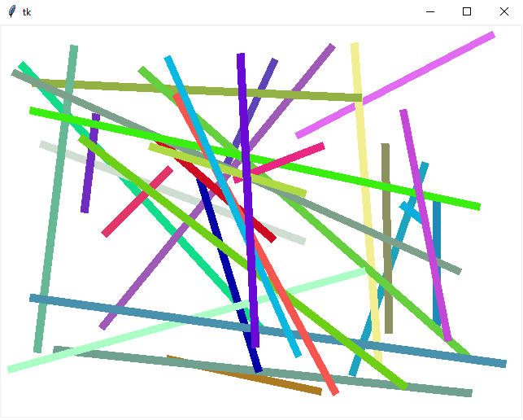
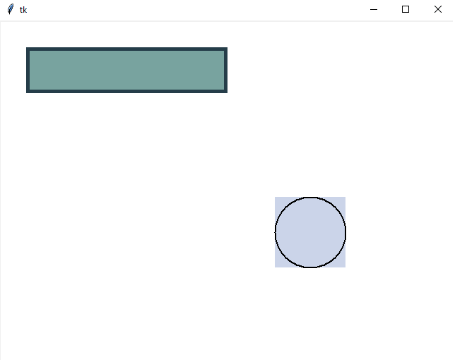
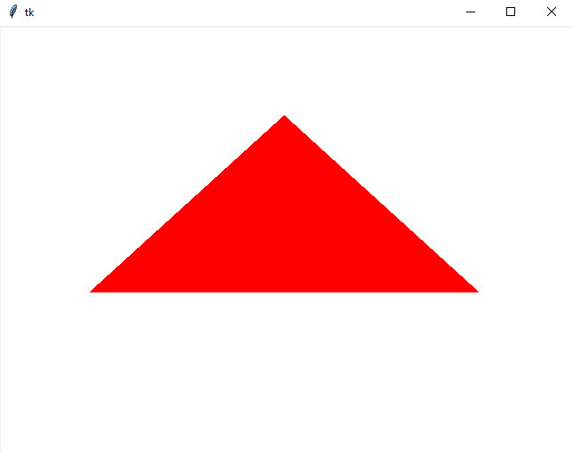
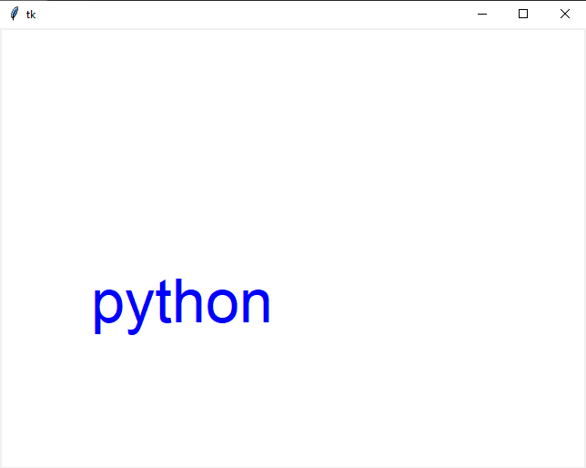
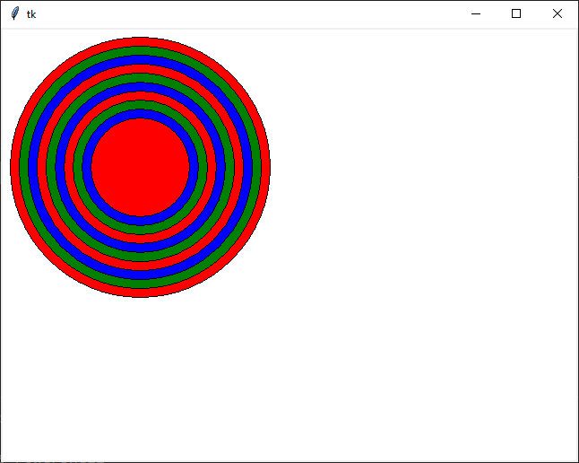
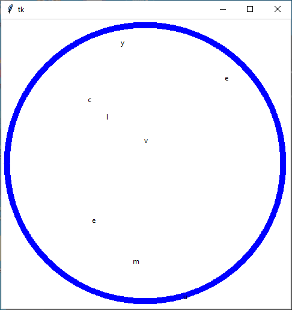

# Grafika

```python
import tkinter 

root = tkinter.Tk()

c = tkinter.Canvas(bg='red', width=640, height=480)
c.pack()

root.mainloop()
```

Prvý riadok naimportuje `tkinter`, v podstate nám to sprístupní všetku funkcionalitu, ktorú nám poskytuje *Tk* *inter*face. 

Druhý riadok vytvorý top level inštanciu `Tk`. Potom vytvoríme `Canvas`, čo je plátno, do ktorého vieme kresliť. Pomocou funkcie `pack` toto plátno vykreslíme na obrazovku. 

Posledný riadok `mainloop` začne hlavnú loopu programu, ktorá čaká na udalosti. Pri spúšťaní z IDLE tento posledný príkaz nie je nutný, pri spúšťaní z VS Code ale je a bez neho sa nám aplikácia hned skončí. 

## Canvas

Na kreslenie do okna (takzvaný `canvas`) používame funkcie ako

  * `create_line`
  * `create_rectangle`
  * `create_oval`
  * `create_polygon`
  * `create_text`
  * `create_image`

Každá z týchto funkcií dostáva súradnice kde sa má útvar vykresliť. Súradnicové osi začínajú v lavom-hornom rohu a rastú doprava a dolu:



### create_line

Príklad vykreslenia čiary pomocou `create_line`:
```py
import tkinter 

root = tkinter.Tk()

c = tkinter.Canvas(bg='white', width=640, height=480)
c.pack()

c.create_line(10, 10, 630, 470)

root.mainloop()
```
Program vykreslí čiaru ktorá začína 10 pixelov vpravo dolu od ľavé-horného rohu okna a skončí 10 pixelov od pravého-dolného rohu.



Za súradnicami čiary je možné špecifikovať ďalšie pomenované parametre (toto samozrejme nie je kompletný zoznam, ten si môžte pozrieť napríklad [tu](https://anzeljg.github.io/rin2/book2/2405/docs/tkinter/create_line.html)).

* `fill` : farba výplne
* `width` : šírka čiary 

Tu je príklad v ktorom vyskreslíme 30 náhodných čiar:

```py
import tkinter
import random

def get_random_color():
    return f'#{random.randint(0, 16**6):06x}'

root = tkinter.Tk()

c = tkinter.Canvas(bg='white', width=640, height=480)
c.pack()

for _ in range(30):
    c.create_line(random.randint(10, 630),
                  random.randint(10, 470),
                  random.randint(10, 630),
                  random.randint(10, 470),
                  width=10, fill=get_random_color())

root.mainloop()
```



### create_rectangle, create_oval

`create_rectangle` a `create_oval` sú podobné funkcie. Jedna vykreslí obĺžnik, alebo štvorec a druhá s ronvakými parametrami vkreslí doňho elispu, alebo kružnicu. Pre tieto funkcie môžme použiť ďalší paramter

* `outline` : farba čiary

Tu je príklad vykreslenia obdĺžnika a kružnice:

```py
import tkinter 

root = tkinter.Tk()

c = tkinter.Canvas(bg='white', width=640, height=480)
c.pack()

c.create_rectangle(40, 40, 320, 100, width=5, fill='#78A39F', outline='#253D49')

c.create_rectangle(390, 250, 490, 350, width=0, fill='#CBD4E9')
c.create_oval(390, 250, 490, 350, width=2, outline='black')

root.mainloop()
```



### create_polygon

`create_polygon` nedostáva na vstupe 4 súradnice ako funkcie doteraz, ale dostáva lubovolne vela bodov, teda dvojíc `x` a `y`. Funkcia spojí tieto body čiarou v poradí v akom boli zadané. Napríklad:
```py
import tkinter 

root = tkinter.Tk()

c = tkinter.Canvas(bg='white', width=640, height=480)
c.pack()

c.create_polygon(100, 300, 320, 100, 540, 300, width=5, fill='red')

root.mainloop()
```



### create_text

Funkcia vypíše text na obrazovku. Na vstupe dostáva len jeden bod, ktorý predstavuje stred obdĺžnika v ktorom sa text nachádza. Ďalej je možné použiť (okrem iných) tieto pomenované parametre:
* `text` : text ktorý sa má vypísať
* `font` : font ktorým sa má text vypísať, napríklad `font=('Arial', 12, 'bold italic')`, kde číslo 12 je velkosť písma

```
root = tkinter.Tk()

c = tkinter.Canvas(bg='white', width=640, height=480)
c.pack()

c.create_text(100, 300, text='python', fill='blue', font=('Arial', 50))

root.mainloop()
```



## Úlohy

1. Naprogramujte aplikáciu, ktorá vykreslí terč. Teda sústredné kružnice ako na obrázku. 
   
2. Ako upravíme aplikáciu z bodu *1* aby bol terčík vždy v strede?
3. Vykreslite náhodný obdĺžnik na obrazovku (pozor musí byť úplne náhodny, teda aj pozícia aj rozmery). 
4. Naprogramujte aplikáciu, ktorá má na vstupe jeden string a potom vykreslí na obrazovku veľký kruh a všetky písmená tohoto slova vypíše na náhodné pozície v tomto kruhu. 
   

## Domáca úloha

TODO
