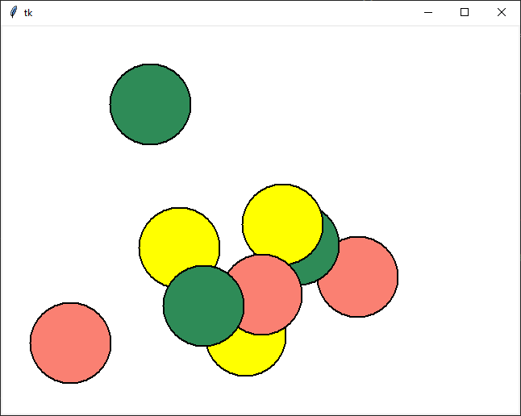

# Grafika

Na dnešnej hodine sme robili, to čo je už popísané v [opakovaní pre SEN2](../sen2/5-events.md). *Časť od začiatku po udalosti.*

## Úlohy

1. Naprogramujte aplikáciu, ktorá vykreslí terč. Teda sústredné kružnice ako na obrázku. 
   
2. Ako upravíme aplikáciu z bodu *1* aby bol terčík vždy v strede?
3. Vykreslite náhodný obdĺžnik na obrazovku (pozor musí byť úplne náhodny, teda aj pozícia aj rozmery). 
4. Naprogramujte aplikáciu, ktorá má na vstupe jeden string a potom vykreslí na obrazovku veľký kruh a všetky písmená tohoto slova vypíše na náhodné pozície v tomto kruhu.
   

## Domáca úloha

Deadline utorková skupina 19. apríl (pondelok) 2021 23:59.

Deadline stredajšia skupina 20. apríl (utorok) 2021 23:59.

Naprogramujte grafickú aplikáciu, ktorá do canvasu nakreslí deväť kruhov (teda budú vyplnené farbou) s polomerom 50 bodov na náhodnú pozíciu. Urobte to tak aby bola využitá celá plocha. Vyberte si tri farby, tri kruhy budú prvou farbou, tri druhou a tri poslednou farbou. 

### Bonus (1bod)

Pospájajte kruhy domácej úlohy ako na obrázku čiarov hrúbky 10 bodov a farby akú si vyberiete. 

