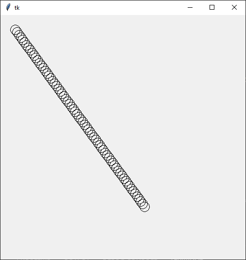

# Grafika 2

Dnes budeme pokračovať v kreslení grafiky do canvasu. 

## Úlohy

1. Naprogramujte funkciu `rand_rectangle(w, h, color)`, ktorá do canvasu `c` nakreslí náhodný obdĺžnik, ktorý bude mať aspoň šírku `w` a výšku `h`, pozor aby nepretrčal. Výplň obdĺžnika má byť zadanou farbou. 
2. Urobte aplikáciu, ktorá nakreslí ruskú zástavu. 
3. Skúsme ešte českú zástavu. 
4. Naprogramujte grafickú aplikáciu, ktorá do canvasu nakreslí náhodný obdĺžnik zelenej farby (podobne ako sme mali *úlohu 1*), potom nakreslite 10 bodov (malé krúžky z polomerom 5 bodov) na náhodné miesta na canvase. S tým, že body, ktoré sa nakreslia vnútri obdĺžnika budú červené a tie čo sú mimo budú modré. 
5. Urobte funkciu `ciara(x0, y0, x1, y1)`, ktorá do canvasu nakreslí čiaru medzi bodmi `(x0, y0)` a `(x1, y1)` s tým, že čiara budú vlastne kružnice s polomerom 10 (ako na obrázku). 
   
   

## Domáca úloha

Deadline utorková skupina 25. apríl (nedeľa) 2021 23:59.

Deadline stredajšia skupina 26. apríl (pondelok) 2021 23:59.

Naprogramujte grafickú aplikáciu, ktorá do canvasu nakreslí náhodný kruh zelenej farby (podobne ako sme mali *úlohu 1* s obdĺžnikom), potom nakreslite 10 bodov (malé krúžky z polomerom 5 bodov) na náhodné miesta na canvase. S tým, že body, ktoré sa nakreslia vnútri kruhu budú červené a tie čo sú mimo budú modré.

