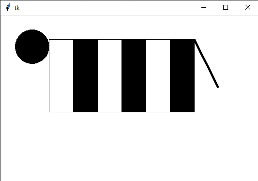

## Domáca úloha

Deadline utorková skupina 2. máj (nedeľa) 2021 23:59.

Deadline stredajšia skupina 3. máj (pondelok) 2021 23:59.

Urobte funkciu zebra s dvoma prametrami `x` a `y`, ktorá nakreslí približne tvar z obrázka (je to taká zebra bez nôh 😎). Parametre `x` a `y` určujú pozíciu na canvase. Či to bude stred obrázka, alebo ľavý horný roh, alebo niečo iné je jedno. 

   

   Rozmery ani tvar nemusíte presne dodržať, len aby to bolo približne tak.