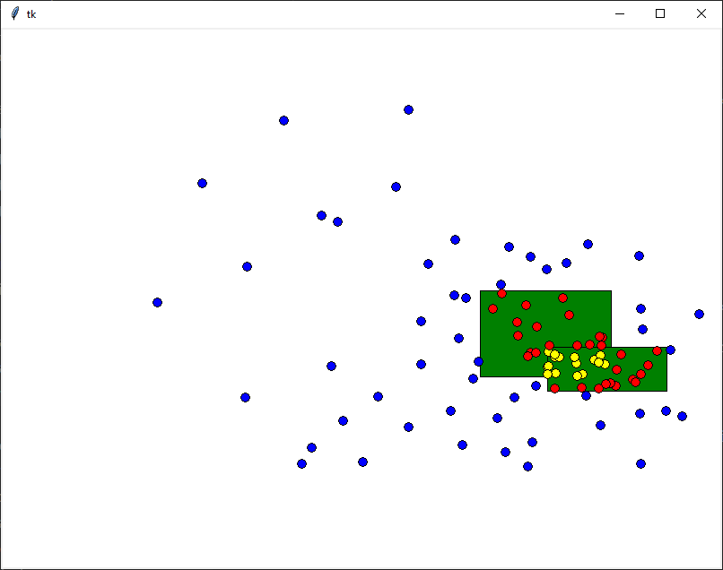

# Udalosti

Na dnešnej hodine sme robili, to čo je už popísané v [opakovaní pre SEN2](../sen2/5-events.md). *Časť od udalosti po koniec.*

## Úlohy

1. Naprogramujte aplikáciu, ktorá vždy po kliknutí nakreslí vycentrovaný (na kurzor) kruh o háhodnej veľkosti (`5` až `50`) a budú sa striedať farby zelená, žltá a červená.

2. Naprogramujte aplikáciu, ktorá pri prvom kliku začne kresliť úsečku a pri druhom ju dokončí. *Vedeli by ste ju upraviť tak aby pravý klik zrušil začatie úsěcky? Teda po ľavom kliku a potom pravom nasledujúci ľavý nedokončí úsečku, ale začne novú.*

3. Naprogramujte aplikáciu, ktorá bude kresliť obdĺžniky, teda po prvok kliknutí začneme a druhý klik obdĺžnik dokončí. Vedeli by sme urobiť aj náhľad v priamom prenose, teda len ťahaním myši by sme videli taký preview?

4. Naprogramujte aplikáciu, ktorá po stlačení písmenka, toto písmenko vypíše na náhodné miesto do canvasu. 

## Domáca úloha

Deadline utorková skupina 23. máj (nedeľa) 2021 23:59.

Deadline stredajšia skupina 24. máj (pondelok) 2021 23:59.

Naprogramujte aplikáciu, ktorá vykreslí do canvasu dva náhodné zelené obdĺžniky. Po kliknutí myšou sa mi na danej pozícií urobím krúžok veľkosti 5 (polomer). Ak bude mimo oboch obdĺžnikov, tak bude modrý, ak bude patriť do práve jedného tak bude červený a ak do oboch, tak žltý (ako na obrázku). 

### Bonus (1bod)

Preprogramujte úlohu *(1)* tak aby sa po kliknutí nezobrazovali kruhy, ale aby som mohol danou farbou a hrúbkou kresliť, teda stlačím myš a pokiaľ ju ťahám, tak robím za sebou čiaru (čiara nemusí byť iba priamka), keď ju pustím, tak čiaru prestanem robiť. *Budete asi potrebovať eventy `<B1-Motion>` a `<ButtonRelease-1>`.*