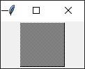
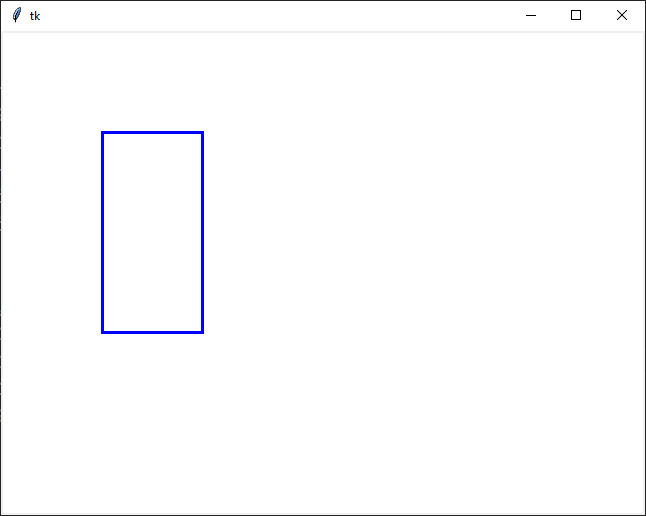

# Práca s pixelmi

V `tkinter` knižnici používame `canvas` na kreslenie grafiky. Bohužial nevieme priamo pristupovať k jednotlivým bodom (pixelom). Nato potrebujeme vykresliť na plátno priamo obrázok. Napríklad takto. 

```py
import tkinter
import random

WIDTH, HEIGHT = 640, 480

root = tkinter.Tk()
c = tkinter.Canvas(width=WIDTH, height=HEIGHT, bg='black')
c.pack()
img = tkinter.PhotoImage(width=WIDTH, height=HEIGHT)
c.create_image(WIDTH / 2, HEIGHT / 2, image=img)

# vas kod zacina tu
for x in range(WIDTH):
    y = random.randint(0, HEIGHT - 1)
    img.put('red', (x, y))

pixel = img.get(10, 10)
red = pixel[0] # cervene zlozka
green = pixel[1] # zelena zlozka
blue = pixel[2] # modra zlozka
# vas kod konci tu

root.mainloop()
```

Zaujímavé sú dve metódy `PhotoImage` a to `get` a `put`. Operácie prístupu priamo k pixelom môžu byť veľmi pomalé, preto si možno radšej zmenšite orázok na povedzme 100x100, alebo ešte menej ak vám to nepôjde. 

## put

Metóda `put` má dva parametre prvý je farba pixelu a druhý súradnice kam sa má dať. Súradnice sú vo formáte `(x, y)`. Takto vieme priamo meniť pixel na obrazovke. 

## get

Metóda `get` je opačná k metóde `put`, teda vráti nám farbu aká sa nachádza na pozícií `x` a `y`. Takto vrátená farba je pole troch čísel, ktoré reprezentujú červenú, zelenú a modrú zložku. Jednotlivé zložky sú čísla od `0` po `255`.

## Úlohy

1. Naprogramujte funkciu `def obdlznik(x0, y0, x1, y1, farba)`, ktorá nakreslí pomocou funkcií `put` obdĺžnik, kde jeden roh bude `x0`, `y0` a protiľahlý roh bude `x1`, `y1` a farba obdĺžnika bude `farba`. 
2. Naprogramujte aplikáciu, ktorá vyplný `canvas` pomocou `put` a `get` šachovnicou z bielych a čiernych pixelov. Ako na obrázku, nevšímajte si ten pravý a dolný kraj, neviem prečo to je a nepodarilo sa mi to odstrániť, to môžete mať aj vy. Rovnako si dajte obrázok menší, ja mám *64 x 64*, lebo inak to dlho trvá. 

   

## Domáca úloha 

Deadline utorok 2. február 2021 (23:59).

Naprogramujte funkciu ako v úlohe 1, ale s tým, že obdĺžnik bude mať hrúbku čiary 3. Teda akoby ste urobili tri obdĺžniky posunuté o jeden pixel. Funkcia má definíciu ako `def obdlznik3(x0, y0, x1, y1, farba)`.

