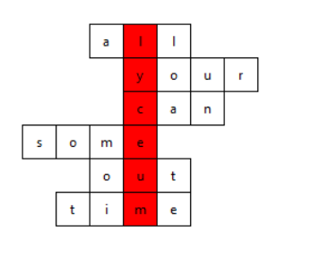

Dnes nás čakajú iba úlohy. 

1. [Bonus](./strings4.md) z predchádzajúcej hodiny.

2. V súbore `words.txt` sú slová z anglického jazyka. Vaša aplikácia načíta zo vstupu slovo a potom pomocou týchto slov zo slovníka vyrobí tajničku (zarovná slová na výpise, aby sa z hore dolu dalo prečítať dané slovo). Napríklad pre slovo *evanjelickelyceum* môže byť výstup takýto. 

   ```plain
   some
     over
    what
    can
      just
     we
     all
    said
    each
    like
   other
    will
      your
   which
     were
     out
    time
   ```

## Domáca úloha

Deadline streda 24. február 2021 (23:59).

Naprogramujete gui k úlohe dva. Všetky slová musia byť vo štvorčekoch a samotné slovo musí byť vyznačené. Vstup môže byť stále pomocou funkcie `input`. Vyzerať by to malo ako na obrázku. 




