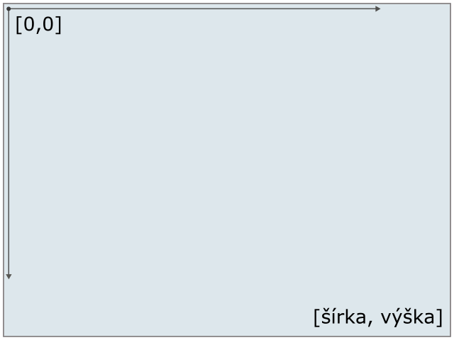
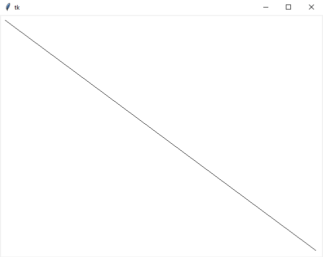
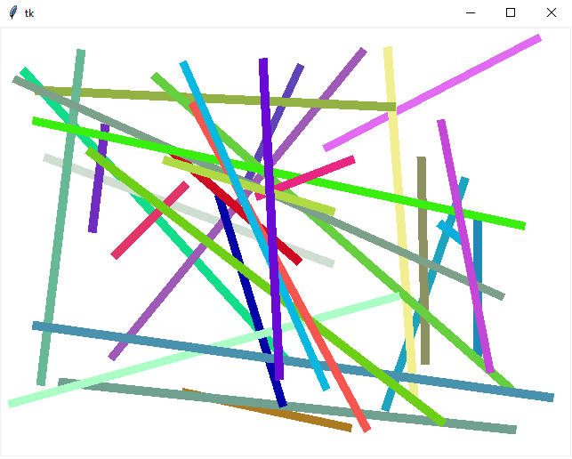
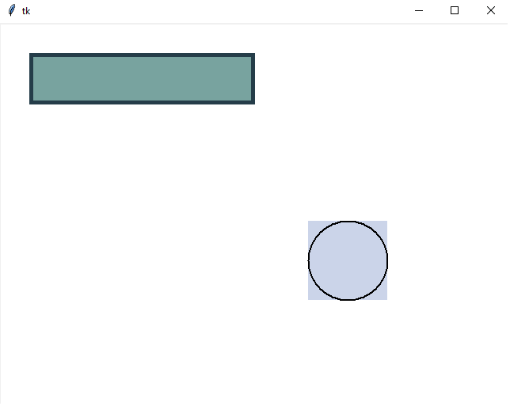
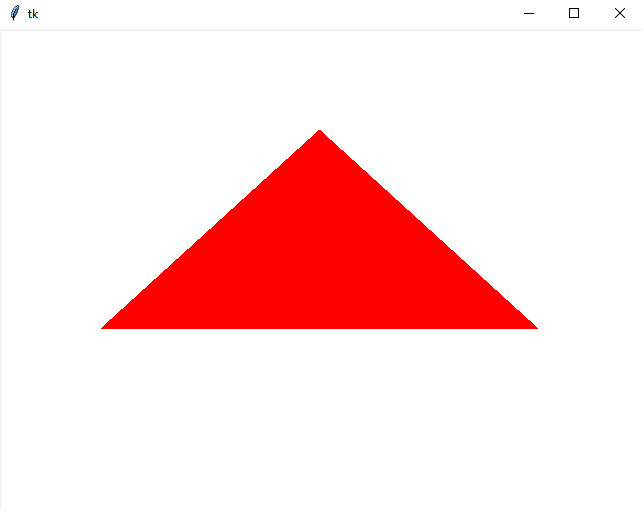
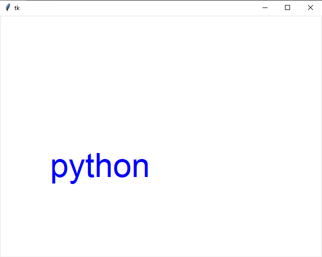

# Grafika

V predchádzajúcej hodine sme mali ako [vyrobiť](./4-recap3.md) v `Tk` okno, do ktorého vieme kresliť. 

## Canvas

Na kreslenie do okna (takzvaný `canvas`) používame funkcie ako

  * `create_line`
  * `create_rectangle`
  * `create_oval`
  * `create_polygon`
  * `create_text`
  * `create_image`

Každá z týchto funkcií dostáva súradnice kde sa má útvar vykresliť. Súradnicové osi začínajú v lavom-hornom rohu a rastú doprava a dolu:



### create_line

Príklad vykreslenia čiary pomocou `create_line`:
```py
import tkinter 

root = tkinter.Tk()

c = tkinter.Canvas(bg='white', width=640, height=480)
c.pack()

c.create_line(10, 10, 630, 470)

root.mainloop()
```
Program vykreslí čiaru ktorá začína 10 pixelov vpravo dolu od ľavé-horného rohu okna a skončí 10 pixelov od pravého-dolného rohu.



Za súradnicami čiary je možné špecifikovať ďalšie pomenované parametre (toto samozrejme nie je kompletný zoznam, ten si môžte pozrieť napríklad [tu](https://anzeljg.github.io/rin2/book2/2405/docs/tkinter/create_line.html)).

* `fill` : farba výplne
* `width` : šírka čiary 

Tu je príklad v ktorom vyskreslíme 30 náhodných čiar:

```py
import tkinter
import random

def get_random_color():
    return f'#{random.randint(0, 16**6):06x}'

root = tkinter.Tk()

c = tkinter.Canvas(bg='white', width=640, height=480)
c.pack()

for _ in range(30):
    c.create_line(random.randint(10, 630),
                  random.randint(10, 470),
                  random.randint(10, 630),
                  random.randint(10, 470),
                  width=10, fill=get_random_color())

root.mainloop()
```



### create_rectangle, create_oval

`create_rectangle` a `create_oval` sú podobné funkcie. Jedna vykreslí obĺžnik, alebo štvorec a druhá s ronvakými parametrami vkreslí doňho elispu, alebo kružnicu. Pre tieto funkcie môžme použiť ďalší paramter

* `outline` : farba čiary

Tu je príklad vykreslenia obdĺžnika a kružnice:

```py
import tkinter 

root = tkinter.Tk()

c = tkinter.Canvas(bg='white', width=640, height=480)
c.pack()

c.create_rectangle(40, 40, 320, 100, width=5, fill='#78A39F', outline='#253D49')

c.create_rectangle(390, 250, 490, 350, width=0, fill='#CBD4E9')
c.create_oval(390, 250, 490, 350, width=2, outline='black')

root.mainloop()
```



### create_polygon

`create_polygon` nedostáva na vstupe 4 súradnice ako funkcie doteraz, ale dostáva lubovolne vela bodov, teda dvojíc `x` a `y`. Funkcia spojí tieto body čiarou v poradí v akom boli zadané. Napríklad:
```py
import tkinter 

root = tkinter.Tk()

c = tkinter.Canvas(bg='white', width=640, height=480)
c.pack()

c.create_polygon(100, 300, 320, 100, 540, 300, width=5, fill='red')

root.mainloop()
```



### create_text

Funkcia vypíše text na obrazovku. Na vstupe dostáva len jeden bod, ktorý predstavuje stred obdĺžnika v ktorom sa text nachádza. Ďalej je možné použiť (okrem iných) tieto pomenované parametre:
* `text` : text ktorý sa má vypísať
* `font` : font ktorým sa má text vypísať, napríklad `font=('Arial', 12, 'bold italic')`, kde číslo 12 je velkosť písma

```
root = tkinter.Tk()

c = tkinter.Canvas(bg='white', width=640, height=480)
c.pack()

c.create_text(100, 300, text='python', fill='blue', font=('Arial', 50))

root.mainloop()
```



## Udalosti

Na viazanie udalostí sa používa funkcia `bind`. Má dva parametre, prvý je meno udalosti a druhý je callback funkcia, ktorá sa má zavolať. Napríklad 

```py
import tkinter 

def click(event):
  print(event.x, event.y)

root = tkinter.Tk()

c = tkinter.Canvas(bg='red', width=640, height=480)
c.bind("<Button-1>", click)
c.pack()

root.mainloop()
```

Tu sme zavesili event `click` na udalosť kliknutie ľavým tlačítkom myši. Handler má jeden parameter, čo sú parametre udalosti. Tie môžu byť rôzne pre rôzne udalosti, ale väčšina obsahuje pozíciu kurzora v momente keď udalosť nastala (`x` a `y`).

Tu je zoznam najpoužívanejších udalostí:
| Názov              |Popis                                                                      |
| -------------------|---------------------------------------------------------------------------|
| `<Button-X>`       |Stlačenie tlačidla myši. X môže byť 1 (lavé), 2 (stredné), 3 (pravé)       |
| `<ButtonRelease-X>`|Podobne ako predchádzajúca udalosť, ale v tomto prípade uvolnenie tlačidla |
| `<Double-Button-X>`|Dvojklik na tlačidle                                                       |
| `<Motion>`         |Bola zmenená pozícia kurzora                                               |
| `<BX-Motion>`      |Zmena pozícia kurzora so stlačeným tlačidlom X                             |
| `<Key>`            |Užívatel stlačil klávesu, stlačená klávesa bude v `char` parametre         |

Aby naše okno získavalo udalosti ohladne stlačených kláves, musíme jej nastaviť fokus pomocou `focus_set`

```py
import tkinter 

def keypress(event):
    print(event)

root = tkinter.Tk()

c = tkinter.Canvas(bg='red', width=640, height=480)
c.bind("<KeyPress>", keypress)
c.pack()

c.focus_set()

root.mainloop()
```
Po stlačení klávesy `a` by sa malo vypísať na konzolu niečo takéto:
```
<KeyPress event state=Mod1 keysym=a keycode=65 char='a' x=515 y=584>
```

## Úlohy

1. Naprogramujte aplikáciu, ktorá nájde najväčšie číslo, ktoré vznikne ako súčin dvoch práve štvorciferných čísel a je zároveň aj palindrom. Pre trojciferné je výsledok `906609`. 

2. Naprogramujte funkciu, ktorá bude mať tri parametre `x`, `y` a `width`, do globálneho canvasu `c` vykreslí mriežku ako na obrázku, s tým že ľavý horný roh bude na pozícii `(x, y)`. A šírka jedného políčka bude `width`.

   

3. Upravte funkcia v *(1)*, aby vykreslila šachovnicu. 

   

4. Naprogramujte aplikáciu, ktorá vždy po kliknutí nakreslí vycentrovaný (na kurzor) kruh o háhodnej veľkosti (`5` až `50`) a budú sa striedať farby zelená, žltá a červená.

5. Naprogramujte aplikáciu, ktorá pri prvom kliku začne kresliť úsečku a pri druhom ju dokončí. *Vedeli by ste ju upraviť tak aby pravý klik zrušil začatie úsěcky? Teda po ľavom kliku a potom pravom nasledujúci ľavý nedokončí úsečku, ale začne novú.*

## Domáca úloha (3 body + 1 bod)

Deadline utorok 3. november 2020 (23:59)

1. Naprogramujte funkciu `uloha`, ktorá bude mať štyri parametre `x`, `y`, `n` a `width`, do globálneho canvasu `c` vykreslí obdĺžniky ako na obrázku, ľavý horný roh bude na pozícii `(x, y)`. A šírka prvého obdĺžnika bude `width` a ostatné budú vždy narastať o `width`. Dokopy bude `n` obdĺžnikov.

   

2. Naprogramujte aplikáciu, ktorá nájde všetky čísla, ktoré vznikli ako súčin dvoch štvorciferných čísel a dajú sa napísať ako dve rovnaké čísla za sebou, teda napríklad `592592` (dá sa napísať ako `592` dva krát po sebe). Vypíšte iba tie čísla, ktoré sa dajú deliť (`10032`). *Poznámka, nevadí ak budete mať na výstupe dva krát to isté číslo.*

### Bonus

1. Preprogramujte úlohu *(3)* tak aby sa po kliknutí nezobrazovali kruhy, ale aby som mohol danou farbou a hrúbkou kresliť, teda stlačím myš a pokiaľ ju ťahám, tak robím za sebou čiaru (čiara nemusí byť iba priamka), keď ju pustím, tak čiaru prestanem robiť. *Budete asi potrebovať eventy `<B1-Motion>` a `<ButtonRelease-1>`.*