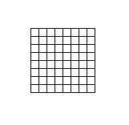
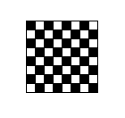
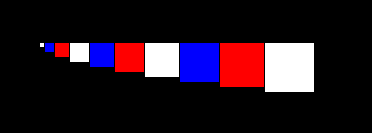

# Grafika

V predchádzajúcej hodine sme mali ako [vyrobiť](./4-recap3.md) v `Tk` okno, do ktorého vieme kresliť. 

## Canvas

Zaujimavé funkcie na kreslenie v `canvas`e sú 
  
  * `create_oval`
  * `create_rectangle`
  * `create_text`
  * `create_image`
  * ...

Všetky tieto sú dobre popísané inde a ich opis tu je trochu ako nosenie dreva do lesa. Dobrý tutorial je napríklad <https://www.python-course.eu/tkinter_canvas.php>.

## Udalosti

Na viazanie udalostí sa používa funkcia `bind`. Ma dva parametre, prvý je meno udalosti a druhý je callback funkcia, ktorá sa má zavolať. Napríklad 

```py
import tkinter 

def click(event):
  print(event.x, event.y)

root = tkinter.Tk()

c = tkinter.Canvas(bg='red', width=640, height=480)
c.bind("<Button-1>", click)
c.pack()

root.mainloop()
```

Tu sme zavesili event `click` na udalosť kliknutie ľavým tlačítkom myši. Handler má jeden parameter, čo sú parametre udalosti. Vypisovať všetky udalosti by znovu bolo vyčerpávajúce a až je to urobené inde. Napríklad <https://effbot.org/tkinterbook/tkinter-events-and-bindings.htm> v časti *Event Formats*.

## Úlohy

1. Naprogramujte aplikáciu, ktorá nájde najväčšie číslo, ktoré vznikne ako súčin dvoch práve štvorciferných čísel a je zároveň aj palindrom. Pre trojciferné je výsledok `906609`. 

2. Naprogramujte funkcia, ktorá bude mať tri parametre `x`, `y` a `width`, do globálneho canvasu `c` vykreslí mriežku ako na obrázku, s tým že ľavý horný roh bude na pozícii `(x, y)`. A šírka jedného políčka bude `width`.

   

3. Upravte funkcia v *(1)*, aby vykreslila šachovnicu. 

   

4. Naprogramujte aplikáciu, ktorá vždy po kliknutí nakreslí vycentrovaný (na kurzor) kruh o háhodnej veľkosti (`5` až `50`) a budú sa striedať farby zelená, žltá a červená.

5. Naprogramujte aplikáciu, ktorá pri prvom kliku začne presliť úsečku a pri druhom ju dokončí. *Vedeli by ste ju upraviť tak aby pravý klik zrušil začatie úsěcky? Teda po ľavom kliku a potom pravom nasledujúci ľavý nedokončí úsečku, ale začne novú.*

## Domáca úloha (3 body + 1 bod)

Deadline utorok 27. október 2020 (23:59)

1. Naprogramujte funkcia `uloha`, ktorá bude mať štyri parametre `x`, `y`, `n` a `width`, do globálneho canvasu `c` vykreslí obdĺžniky ako na obrázku, ľavý horný roh bude na pozícii `(x, y)`. A šírka prvého obdlížnika bude `width` a ostatné buduú vždy narastat o `width`. Dokopy bude `n` obdĺžnikov.

   

2. Naprogramujte aplikáciu, ktorá nájde všetky čísla, ktoré vznikli ako súčin dvoch štvorciferných čísel a dajú sa napísať ako dve rovnaké čísla za sebou, teda napríklad `592592` (dá sa napísať ako `592` dva krát po sebe). Vypíšte iba tie čísla, ktoré sa dajú deliť (`10032`). *Poznámka, nevadí ak budete mať na výstupe dva krát to isté číslo.*

### Bonus

1. Preprogramujte úlohu *(3)* tak aby sa po kliknutí nezobrazovali kruhy, ale aby som mohol danou farbou a hrúbkou kresliť, teda stlačím myš a pokiaľ ju ťahám, tak robím za sebou čiaru (čiara nemusí byť iba priamka), keď ju pustím, tak čiaru prestanem robiť. *Budete asi potrebovať eventy `<B1-Motion>` a `<ButtonRelease-1>`.*