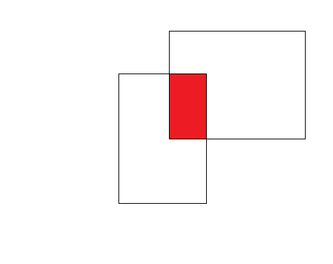

# Udalosti a časovač

Na [predchádzajúcej hodine](./5-events.md) sme sa rozprávali o základnej grafike a udalostiach. Častým motívom je, že si musíme zapamätať súradnice myši kvôli tomu aby sme si napríklad vedeli pri pohybe zapamätať kde sme boli pred chvílou. 

```py
import tkinter 

root=tkinter.Tk()
c = tkinter.Canvas(bg='white', width=640, height=480)
c.pack()

x = 0
y = 0

def startMoving(event):
  global x, y
  x = event.x
  y = event.y

def draw(event):
  global x, y

  c.create_line(x, y, event.x, event.y, width=1)
  x = event.x
  y = event.y

c.bind("<B1-Motion>", draw)
c.bind("<1>", startMoving)

root.mainloop()
```

Takto si zapamätamé súradnice pri prvom kliku a potom pri pohybe myšou ich budeme používať na to aby sme zistili ako a koľko sme prešli po canvase.

## Časovač

Na funkciu časovača môžeme využit metódu canvasu `after`, ktorá berie dva parametre, prvý je čas za ktorý sa má tiknúť a druhý funkcia, ktorá sa má zavolať, napríklad, každú sekundu sa objaví na náhodnej pozícii červený štvorček. 

```py
import tkinter
from random import randint

root=tkinter.Tk()
c = tkinter.Canvas(bg='white', width=640, height=480)
c.pack()

def tick():
  x = randint(0, 640)
  y = randint(0, 480)
  c.create_rectangle(x, y, x + 10, y + 10, fill='red')

  '''
  Casovac sa standardne neopakuje, takze ak chceme opakujuci sa 
  musime na koniec ticku pridat dalsie volanie ticku po istom case
  '''
  c.after(1000, tick)

c.after(1000, tick)

root.mainloop()
```

## Pekné kreslenie

Stalo sa nám na hodine, že kreslenie hrubších čiar bolo také nepekne zubaté. Príčinou je, že predvolené ukončovanie čiar nie je vhodné na kreslenie. Ak to chcete mať OK musíte použiť parameter `capstyle`. 

```py
c.create_line(x, y, x1, y1, width=30, capstyle=tkinter.ROUND)
```

## Úlohy

1. Naprogramujte bonus z [predchádzajúcej hodiny](./5-events.md). 
2. Naprogramujte časovač, ktorý pekným veľkým písmom odpočítava 60 sekúnd a posledných 10 bude červenou farbou, pričom na 0 skončí (nejde do záporných hodnôt).
3. Naprogramujte aplikáciu, ktorá vykreslí dva náhodné obdĺžniky a vyznačí ich prienik červenou farbou (sa dá spraviť napríklad nakreslením nového obdĺžnika na prieniku).

   

4. Naprogramujte aplikáciu, ktorá po stlačení medzerníka na pozíciu kurzora otlačí obrázok nižšie. Teda vždy keď budeme myšou nad canvasom a stlačíme medzerník, tak sa toto logo vykreslí na pozíciu kurzora. Obrázok si stiahnite a uložte vedľa python programu, ktorý píšete. Ako sa kreslí do canvasu obrázok sa môžete dočítať napríklad na <https://stackoverflow.com/a/43009579>.

   


## Domáca úloha (3 body + 1 bod)

Deadline utorok 10. november 2020 (23:59)

Naprogramujte aplikáciu, ktorá bude fungovať ako úplne jednoduchý skicár. Na začiatku budete mať prázdny biely canvas, dajte mu rozmery aspoň `640x480`. Aplikácia bude mať štyri jednoduché funkcie.

1. Po stlačení `c` (ako clear) vymaže všetko čo práve máme na canvase. 
2. Ľavým tlačítkom kreslím čiaru hrúbky 3.
3. Pravým tlačítkom gumujem (čo je efektívne to isté ako kreslenie bielej čiary). Tu použite hrúbku 5.
4. Vyberte si `4` ľubovoľné farby (nie bielu) a každé tri sekundy meňte cyklicky tieto farby pre kreslenie ľavým tlačítkom myši. Teda napríklad ak si vyberiete modrú, zelenú, lososovú a cyklaménovú, tak začne sa kresliť modrou, po troch sekundách zelenou, po ďalších troch lososová, potom cyklaménová a po nasledujúcich troch zvovu modrá, zelená...

### Bonus

Do domácej úlohy naprogramujte ešte túto funkcionalitu. 

5. V ľavom hornom rohu sa vypíše string `Hrubka: XXX`, kde `XXX` bude aktuálna hrúbka čiary (na začiatku 3) a hrúbka sa bude dať meniť kurzorovou šípkou hore (hrúbka sa zvýši o `1`) a šípkou dolu (hrúbka sa zníži o `1`, pozor nemôžeme ísť pod 1, najmenšia prípustná hrúbka je `1`). 