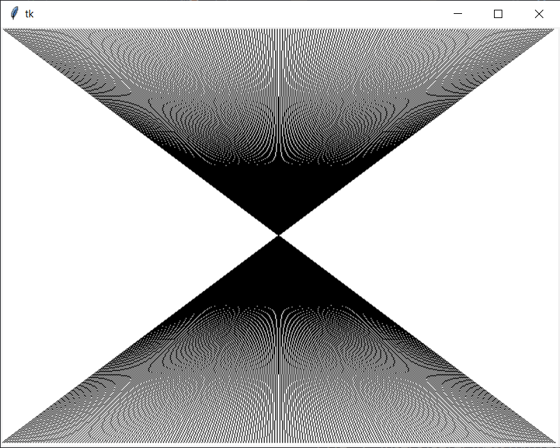

# Opakovanie

## Úlohy

1. Existuje nekonečne veľa prvočíselných dvojičiek. To sú také čísla, ktorých rozdiel je 2 a zároveň sú to prvočísla. Napríklad `3` a `5`, alebo `11` a `13`. Naprogramujte aplikáciu, ktorá nájde všetky takéto dvojice po nejaké zadané `n`.

## Domáca úloha

Deadline štvrtok 19. november 2020 (23:59)

Vyberte si dve úlohy dokopy za 3 body, alebo vyriešte všetky 3 a budete to mať za 4 body (teda aj s bonusom).

1. Nakreslite do canvasu nasledovný útvar. Vznikol tak, že robíte čierne čiary z ľavého horného do pravého dolného rohu s tým, že sa vždy posuniete o tri pixeli. Čiže ak máte canvas veľký `640x480`, tak prvá čiara bude z bodu `(0,0)` do bodu `(639,479)`, druhá z bodu `(3,0)` do  `(636,479)`, ... až posledná z `(639,0)` do `(0,479)`. Urobte to tak, aby sa čiary nenakreslili naraz, ale každá ďalšia sekundu po predchádzajúcej s tým, že prvá sa nakreslí po spustení programu. 

   

2. Naprogramujte aplikáciu, ktorá dostane na vstup dve čísla `A` a `B`, potom nájde a vypíše všetky čísla väčšie alebo rovné ako `A` a menšie alebo rovné ako `B`, ktoré sú skoro prvočísla. Skoro prvočísla sú všetky čísla, ktoré sa okrem samého seba a `1` dajú deliť ešte najviac dvoma inými číslami. Čiže
   * `1` nie je skoro prvočíslo
   * `2` a `3` nie je, lebo je prvočíslo
   * `4` je skoro prvočíslo, lebo sa dá deliť `2`
   * `5` nie je, lebo je prvočíslo
   * `6` je, lebo sa dá deliť `2` a `3`
   * `7` nie je, lebo je prvočíslo
   * `8` je, lebo sa dá deliť `2` a `4`
   * `9` je, lebo sa dá deliť `3`
   * `10` je, lebo sa dá deliť `2` a `5`
   * `12` nie je, lebo sa dá deliť `2`, `3`, `4` a `6`
   * `25` je, lebo sa dá deliť `5`

3. Nakreslite do canvasa tabuľku 3x3, ktorá bude vyplnená náhodnými číslami od `1` po `9`, čísla sa môžu opakovať. 

   