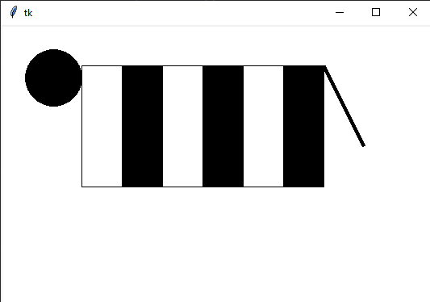

# P칤somka

Tento t칳쬯e켿 sme mali p칤somku cez Google Forms.

## Dom치ca 칰loha (3 body)

Deadline utorok 24. november 2020 (23:59)

1. Urobte funkciu zebra s dvoma prametrami `x` a `y`, ktor치 nakresl칤 pribli쬹e tvar z obr치zka (je to tak치 zebra bez n칪h 游땙). Parametre `x` a `y` ur캜uj칰 poz칤ciu na canvase. 캛i to bude stred obr치zka, alebo 쬬v칳 horn칳 roh, alebo nie캜i in칠 je jedno. 

   

   Rozmery ani tvar nemus칤te presne dodr쬬콘, u sa te코칤m na tie kreat칰ry, 캜o dostanem 游땔.